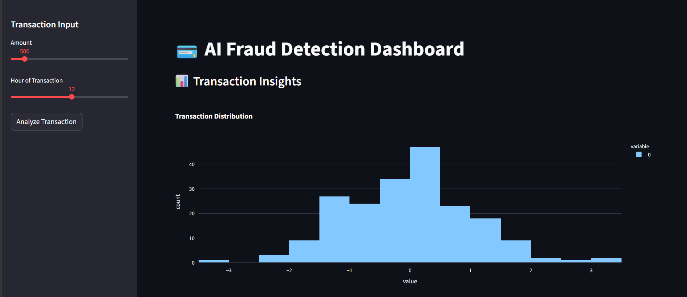
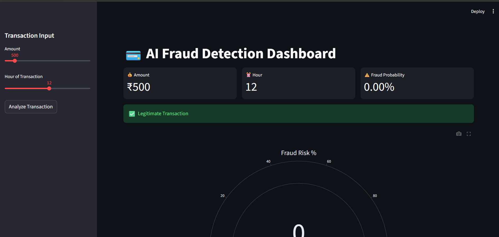
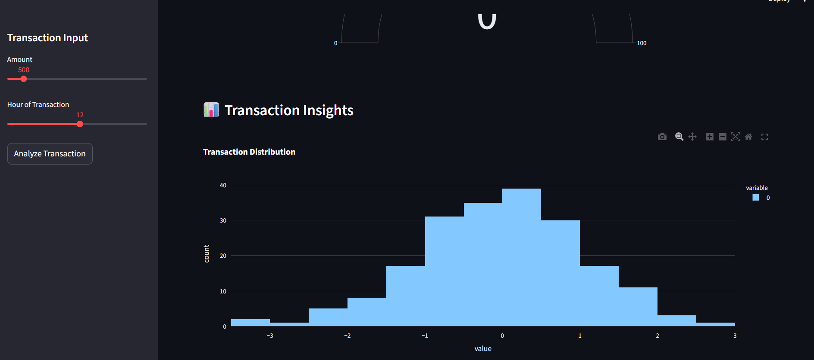
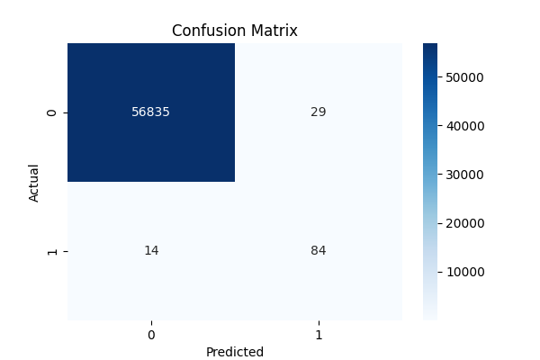
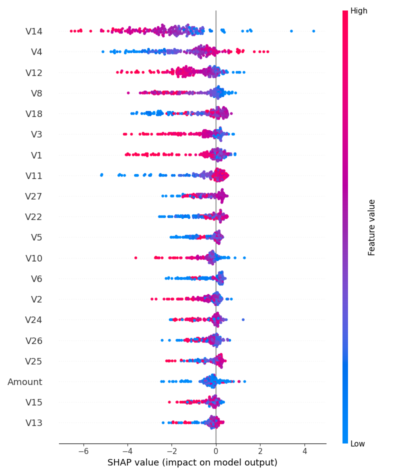

# 💳 Credit Card Fraud Detection System

🚀 A complete end-to-end Machine Learning project that detects fraudulent credit card transactions using advanced models, real-time dashboard, and explainable AI.

---

## 📌 Overview

Fraud detection is critical in banking and fintech to prevent financial loss and protect customers.

This project builds a **real-time fraud detection system** that:

* Detects fraudulent transactions
* Handles imbalanced data using SMOTE
* Uses XGBoost for high performance
* Provides explainability using SHAP
* Displays results in a premium dashboard

---

## 🎯 Objective

* Detect fraud with high recall
* Build industry-level ML pipeline
* Visualize results using dashboard
* Provide explainable predictions

---

## 🧠 Tech Stack

* Python
* Pandas, NumPy
* Scikit-learn
* XGBoost
* SMOTE
* SHAP
* Streamlit
* Plotly

---

## ⚙️ Features

* ✅ Fraud detection using XGBoost
* ✅ Imbalanced data handling (SMOTE)
* ✅ SHAP explainability
* ✅ Premium dark dashboard UI
* ✅ KPI metrics + Gauge chart
* ✅ Real-time prediction

---

## 📂 Project Structure

```bash
Credit-Card-Fraud-Detection/
│── data/
│── models/
│   └── fraud_model.pkl
│── outputs/
│── images/
│── app/
│   └── dashboard.py
│── main.py
│── requirements.txt
│── README.md
```

---
## 📥 Dataset

Dataset used: Credit Card Fraud Detection Dataset

Download from:
https://www.kaggle.com/datasets/mlg-ulb/creditcardfraud

## ▶️ How to Run

### 1️⃣ Install dependencies

```bash
pip install -r requirements.txt
```

### 2️⃣ Train model

```bash
python main.py
```

### 3️⃣ Run dashboard

```bash
streamlit run app/dashboard.py
```

---

## 📊 Results

* Accurate fraud detection
* High recall for fraud class
* Clear model explainability
* Interactive visualization

---

## 📸 Screenshots

### 🖥️ Dashboard UI



---

### 🔍 Prediction Result




---


### 📊 Confusion Matrix



---

### 🧠 SHAP Feature Importance



---

## 💼 Industry Relevance

Used in:

* Banking systems
* Payment gateways
* Fintech platforms
* E-commerce fraud detection

---

## 🎯 Learning Outcomes

* Handling imbalanced datasets
* Building ML pipelines
* Model evaluation
* Explainable AI
* Dashboard development

---

## 🚀 Future Improvements

* Real-time Kafka streaming
* Email/SMS alerts
* Cloud deployment (AWS/GCP)

---

## 👩‍💻 Author

**Sanskritika Awasthi**

---

## ⭐ If you like this project

Give it a ⭐ on GitHub!
